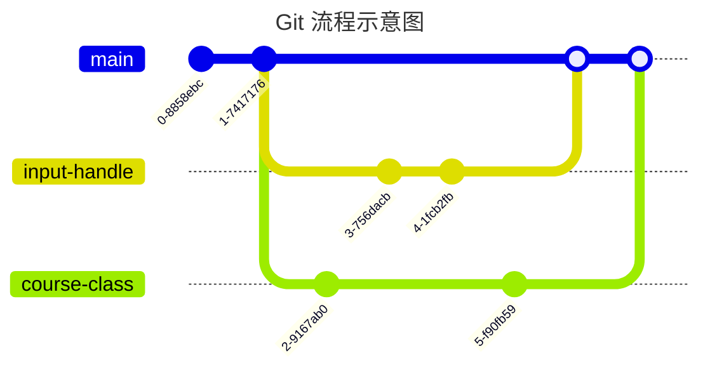
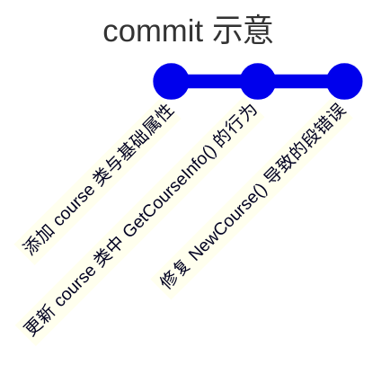

# Git 工作流

## 目录

- [Git 工作流](#git-工作流)
  - [目录](#目录)
  - [分支开发](#分支开发)
  - [Commit 规则](#commit-规则)

## 分支开发

- `main` 分支将作为多功能主分支，所有完成的功能将合并于此。
- 所有的更改必须从 `main` 分支上新建 `branch`，在自己的 `branch` 上完成开发后再合并至主分支。
- 分支的命名应当描述清楚该分支专注的功能，使用英文全拼，全部小写，单词间用 `-` 连接。
- 分支完成后需要以 Pull Reuest 的方式请求合并，在审核通过后才能合并至主分支。

## Commit 规则

- 三思后行：commit 一经做出无法重做，为保证相对清晰的 Git 树，在确认无误后再 commit。
- 适度 commit：没有必要做“commit 狂魔”，但也不要一次 commit 太多东西。
- commit 信息：简洁、明了、具体，使用现在时，描述为什么进行这次 commit。
- commit 模板：如果不会写，那就完成这个填空：*如果生效，这次 commit 将会 `<commit 信息>`*。

